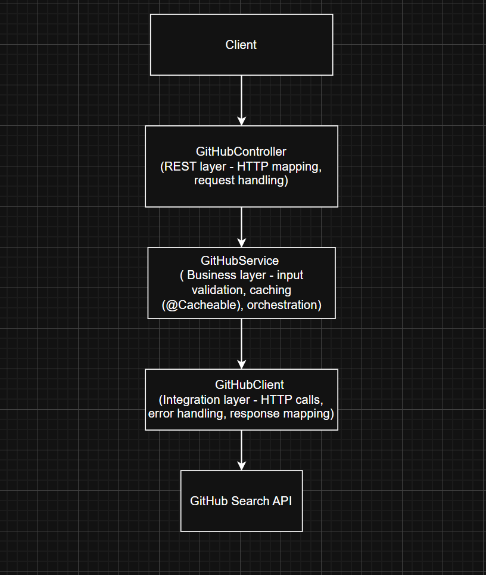

# GitHub Repository Explorer — Spring Boot Microservice

A production-ready Spring Boot 3.1 microservice that exposes a REST API for discovering the hottest GitHub repositories created in the last 7 days, ranked by star count.

---

## Table of Contents

- [Quick Start](#quick-start)
- [API Reference](#api-reference)
- [Architecture](#architecture)
- [Design Decisions](#design-decisions)
- [Security](#security)
- [Testing](#testing)
- [Project Structure](#project-structure)

---

## Quick Start

**Prerequisites:** Java 17, Maven 3.8+

```bash
# Clone and build
mvn clean install

# Run the microservice
cd microservice
mvn spring-boot:run
```

The service starts on **port 8081**.

---

## API Reference

### `GET /repositories/hottest`

Returns the highest-starred GitHub repositories created in the last 7 days, sorted by star count descending.

| Parameter | Type    | Default | Constraints         | Description                      |
|-----------|---------|---------|---------------------|----------------------------------|
| `limit`   | integer | `10`    | min: `1` max: `100` | Number of repositories to return |

---

### Health Check

```
GET http://localhost:8081/actuator/health
```
```json
{
    "status": "UP"
}
```

---

### Fetch hottest repositories (default limit of 10)

```
GET http://localhost:8081/repositories/hottest
```

---

### Fetch with custom limit

```
GET http://localhost:8081/repositories/hottest?limit=2
```
```json
[
    {
        "language": "Python",
        "description": "\"ClawWork: OpenClaw as Your AI Coworker - 💰 $10K earned in 7 Hours\"",
        "name": "ClawWork",
        "html_url": "https://github.com/HKUDS/ClawWork",
        "watchers_count": 4389
    },
    {
        "language": "PowerShell",
        "description": "VSCode theme based off the easemate IDE and Jetbrains islands theme",
        "name": "vscode-dark-islands",
        "html_url": "https://github.com/bwya77/vscode-dark-islands",
        "watchers_count": 3697
    }
]
```
---

### Fetch minimum limit (limit=1)

```
GET http://localhost:8081/repositories/hottest?limit=1
```
```json
[
    {
        "language": "Rust",
        "description": "Fast, small, and fully autonomous AI assistant infrastructure — deploy anywhere, swap anything 🦀",
        "name": "zeroclaw",
        "html_url": "https://github.com/zeroclaw-labs/zeroclaw",
        "watchers_count": 15440
    }
]
```

---

### Error — limit below minimum (400 Bad Request)

```
GET http://localhost:8081/repositories/hottest?limit=0
```

```json
{
    "message": "limit must be between 1 and 100",
    "timestamp": "2026-02-20T14:38:57.537315900Z",
    "status": 400,
    "error": "Bad Request"
}
```

---

### Error — limit above maximum (400 Bad Request)

```
GET http://localhost:8081/repositories/hottest?limit=101
```

```json
{
    "message": "limit must be between 1 and 100",
    "timestamp": "2026-02-20T14:38:12.849853300Z",
    "status": 400,
    "error": "Bad Request"
}
``


---

### Error — GitHub API unavailable (503 Service Unavailable)

This scenario is covered by unit tests (`GitHubControllerTest`) rather than a live call, as it requires the upstream GitHub API to be unreachable. The response shape is:

```json
{
  "message": "Unable to reach GitHub API. Please try again later.",
  "status": 503,
  "error": "Service Unavailable"
}
```

---

## Architecture

The service follows a strict three-layer architecture, keeping concerns cleanly separated and each layer independently testable.



---

## Design Decisions

### Caching
Responses are cached per `limit` value using **Caffeine** — a high-performance, in-memory cache.

- **TTL:** 10 minutes — Trending repositories typically do not change significantly within minutes, making short-lived caching appropriate.
- **Max size:** 200 entries — covers all valid `limit` values with headroom

### Timeouts
`RestTemplate` is configured with explicit timeouts to prevent thread exhaustion under slow or unresponsive upstream conditions:

- **Connect timeout:** 3 seconds
- **Read timeout:** 5 seconds

### Error Handling
A centralised `GlobalExceptionHandler` ensures all errors surface with a consistent JSON shape, regardless of where in the stack they originate:

- `IllegalArgumentException` → `400 Bad Request`
- `RuntimeException` (e.g. GitHub unreachable) → `503 Service Unavailable`

Every error response includes `status`, `error`, `message`, and `timestamp` fields.

### Input Validation
The `limit` parameter is validated in the service layer (`1–100`). Keeping validation in the service rather than the controller means it is enforced regardless of how the service is called — directly, via tests, or via the REST layer.

### Separation of Concerns
Each layer has a single, clear responsibility:
- **Controller** — HTTP concerns only (routing, request/response)
- **Service** — business logic and caching
- **Client** — all GitHub API communication isolated in one place, making it easy to swap or mock

---

## Security

| Concern | Approach |
|---|---|
| Security foundation | Spring Security is on the classpath and configured. Currently set to `permitAll()` as per exercise scope — the foundation is in place to add route-level restrictions or token-based auth without restructuring |
| Transport (outbound) | All calls from this service to the GitHub API are made over HTTPS |
| Timeout protection | Connect (3s) and read (5s) timeouts on `RestTemplate` prevent hung threads if GitHub is slow or unresponsive |
| Input bounds | `limit` is validated server-side (`1–100`) to prevent clients from abusing GitHub API quota |
| HTTP security headers | Spring Security automatically adds `X-Content-Type-Options`, `X-XSS-Protection`, `X-Frame-Options`, and `Cache-Control` headers to every response |

---

## Testing

### Run all tests

```bash
mvn test
```

```
Tests run: 11, Failures: 0, Errors: 0, Skipped: 0
```

| Test Class | What it covers |
|---|---|
| `GitHubControllerTest` | HTTP status codes, JSON structure, default parameter handling, error mapping via GlobalExceptionHandler|
| `GitHubServiceTest` | Business rule validation (1–100 bounds), boundary conditions, delegation to GitHubClient |
| `MicroserviceApplicationTests` | Full Spring context startup and actuator health endpoint |

### Manual test commands (PowerShell)

```powershell
# Health check
curl.exe http://localhost:8081/actuator/health

# Default limit (10 results)
curl.exe http://localhost:8081/repositories/hottest

# Custom limit
curl.exe "http://localhost:8081/repositories/hottest?limit=5"

# Minimum boundary
curl.exe "http://localhost:8081/repositories/hottest?limit=1"

# Invalid limit — expect 400
curl.exe -i "http://localhost:8081/repositories/hottest?limit=0"

# Invalid limit — expect 400
curl.exe -i "http://localhost:8081/repositories/hottest?limit=101"
```

---

## Dependencies

| Dependency | Purpose |
|---|---|
| `spring-boot-starter-web` | REST API |
| `spring-boot-starter-security` | Application security |
| `spring-boot-starter-actuator` | Health + info endpoints |
| `spring-boot-starter-cache` | Caching abstraction |
| `caffeine` | High-performance cache implementation |
| `lombok` | Boilerplate reduction |

---

*Built with Java 17 · Spring Boot 3.1*